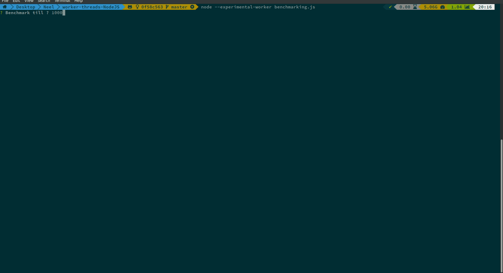

# Idea
## Primes
- Calculating primes is one of the most computationally intensive task, and an important component in computer security.  
- This repo aims at calculating prime numbers, in a certain range, using multithreading concepts in NodeJS.  
- Basic sieve method is used to collect prime numbers. The range is divided between worker-threads here.  
- And the number of worker threads spawned is equal to the number of cores, to maximise output. If more spawned need to switch between threads, which takes time, if more spawned, cores underutilized.

## Worker Threads
- Javascript can handle I/O events easily, owing to EventLoop. Hence, Node can handle multiple HTTP requests pretty seamlessly.  
- But, if Node needs to do heavy computation, it cannot rely on EventLoop, since it runs on single-thread, and all the cores aren't optimally utilized. Here is when, `worker-thread` comes in.  
- From the Worker-Thread Docs-  
- `Workers (threads) are useful for performing CPU-intensive JavaScript operations. They will not help much with I/O-intensive work. Node.js’s built-in asynchronous I/O operations are more efficient than Workers can be.`  
- For tasks like these, even `child_processes` or `cluster` can be used. Although, they don't provide support for transferring or sharing memory as of now.  

### Links
- [EventLoop](https://developer.mozilla.org/en-US/docs/Web/JavaScript/EventLoop)
- [Worker-Thread Docs](https://nodejs.org/api/worker_threads.html#worker_threads_worker_threads)

## Data Structure
- For initialising a worker, passing data in workerData actually clones the data  
- Whereas, for passing messages, using `worker.postMessage()`, data is passed either by cloning, transfering or sharing
- Cloning : `Arrays` are serialised then cloned, and desearialised. Since, the raw data segregation isn't know.
- Transfering : `ArrayBuffer` operate on this, since, they use `TypedArrays` such as `Uint8Array` as layer, owing to which, their raw segment sizes are known, and can be transfered easily.  
- Sharing : `SharedArrayBuffer` is similar to ArrayBuffer, where you need to wrap it using `TypedArrays`, but they can be shared. To maintain concurrency, `Atomics` library is used alongwith it, to perform concurrent opertations  

### Links
- [Array - MDN](https://developer.mozilla.org/en-US/docs/Web/JavaScript/Reference/Global_Objects/Array)
- [ArrayBuffer - MDN](https://developer.mozilla.org/en-US/docs/Web/JavaScript/Reference/Global_Objects/TypedArray)
- [SharedArrayBuffer - MDN](https://developer.mozilla.org/en-US/docs/Web/JavaScript/Reference/Global_Objects/SharedArrayBuffer)
- [TypedArray - MDN](https://developer.mozilla.org/en-US/docs/Web/JavaScript/Reference/Global_Objects/TypedArray)
- [A crash course in memory management - Mozilla Hacks](https://hacks.mozilla.org/2017/06/a-crash-course-in-memory-management/)

## Other Tools used
- [Inquirer.JS](https://github.com/SBoudrias/Inquirer.js/) - To create command line interfaces, in a whim.
- [Ora](https://github.com/sindresorhus/ora) - Elegant terminal spinners for your command line interfaces.
- [Benchmark.JS](https://github.com/bestiejs/benchmark.js/) - A robust benchmarking library, with high-resolution timers.

# Interface
## Interactive CLI

## Benchmarking and write to CSV

# Benchmarks
## CPU
`CPU family:          6 `  
`Model name:          Intel(R) Core(TM) i5-8600K CPU @ 3.60GHz  `

## OS
`Ubuntu 18.04`

| Range    | Thread | DataStructure     | MeanExecTime(in secs)    | NumberOfCycles | 
|----------|--------|-------------------|--------------------------|----------------| 
| 100      | worker | sharedArrayBuffer | 0.05451655452083334      | 48             | 
| 100      | worker | arrayBuffer       | 0.05048775225490198      | 51             | 
| 100      | worker | array             | 0.05209960375510204      | 49             | 
| 100      | main   | normalSieve       | 0.0000026189117609852627 | 88             | 
| 1000     | worker | sharedArrayBuffer | 0.05594300798936169      | 47             | 
| 1000     | worker | arrayBuffer       | 0.06054065555844155      | 77             | 
| 1000     | worker | array             | 0.06030849465384614      | 78             | 
| 1000     | main   | normalSieve       | 0.000025705733772647114  | 88             | 
| 10000    | worker | sharedArrayBuffer | 0.07244938477611937      | 67             | 
| 10000    | worker | arrayBuffer       | 0.05967241462068965      | 58             | 
| 10000    | worker | array             | 0.06134170045454545      | 77             | 
| 10000    | main   | normalSieve       | 0.00028022878913731803   | 83             | 
| 100000   | worker | sharedArrayBuffer | 0.06629550497260277      | 73             | 
| 100000   | worker | arrayBuffer       | 0.06146969272727272      | 77             | 
| 100000   | worker | array             | 0.07276433691044777      | 67             | 
| 100000   | main   | normalSieve       | 0.003791498413793104     | 87             | 
| 1000000  | worker | sharedArrayBuffer | 0.08153615076666666      | 60             | 
| 1000000  | worker | arrayBuffer       | 0.08271871261666669      | 60             | 
| 1000000  | worker | array             | 0.15392867627777776      | 36             | 
| 1000000  | main   | normalSieve       | 0.04862653041509433      | 53             | 
| 10000000 | worker | sharedArrayBuffer | 0.1780489309032258       | 31             | 
| 10000000 | worker | arrayBuffer       | 0.23233239540000003      | 25             | 
| 10000000 | worker | array             | 1.465544911125           | 8              | 
| 10000000 | main   | normalSieve       | 1.631624435625           | 8              | 
| 20000000 | worker | sharedArrayBuffer | 0.36814615133333334      | 18             | 
| 20000000 | worker | arrayBuffer       | 0.8236841264000001       | 10             | 
| 20000000 | worker | array             | 3.2359141328333334       | 6              | 
| 20000000 | main   | normalSieve       | 3.213333790833333        | 6              | 
